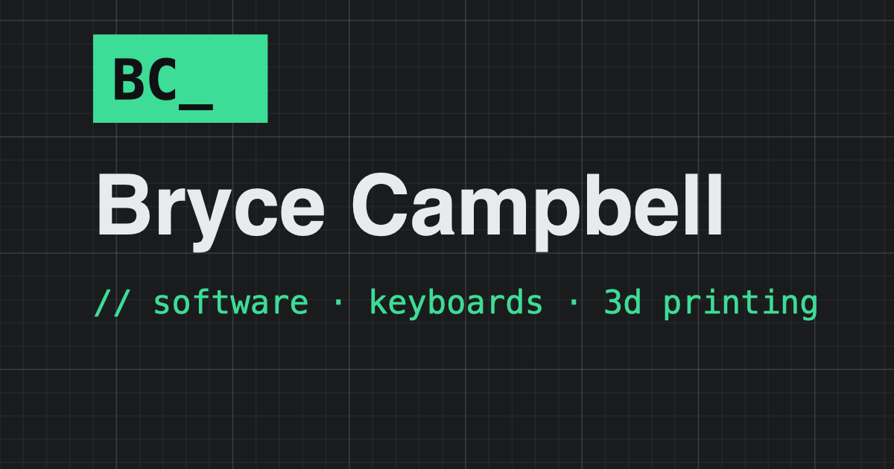

# workbench

The source for [brycecampbell.com](https://brycecampbell.com) — my personal site: software
projects, keyboard builds, 3D printing, and writing about all of it.



## Design: the cutting mat

The whole site is themed after the self-healing cutting mat on my desk — two themes,
like flipping the mat over:

- **Black Mat** (default): near-black with a subtle grid and mint-green accents
- **Green Mat**: emerald with white grid lines

The grid texture is pure CSS (fine lines every 20px, heavier ones every 100px — no
image assets), there's a ruler strip along the footer of every page, and the theme
toggle persists via `localStorage` with a no-flash inline script.

## Stack

- [Astro](https://astro.build) — static output, content collections, zero client JS
  except the theme toggle and project filters
- [Tailwind CSS v4](https://tailwindcss.com) — theme tokens as CSS custom properties
  mapped through `@theme inline`
- MDX content, TypeScript strict, vitest for the pure logic
- Deployed on [Vercel](https://vercel.com) — every push to `main` goes to production

## Architecture

Everything is one of two content collections:

- **`projects`** — anything made: software, keyboards, CAD, PCBs, 3D prints. One
  adaptive detail template: entries with `specs` get a spec sheet, entries with
  `gallery` get a photo grid, entries with repo/live links get buttons. Projects can
  have multiple categories; the first is primary.
- **`posts`** — anything written. Posts can reference a project, which links the two
  in both directions.

The homepage merges both into featured cards plus a recent-activity stream.

Content workflow: copy a template from `docs/templates/` into the matching collection
folder (they document every frontmatter field), write markdown, push. Entries marked
`draft: true` render in local dev but are excluded from production, RSS, and all
listings.

## Development

```bash
npm install
npm run dev      # localhost:4321
npm test         # vitest
npm run check    # astro check
npm run build    # production build (excludes drafts)
```

## License

Code is MIT. Words and images are mine — please don't republish them.
