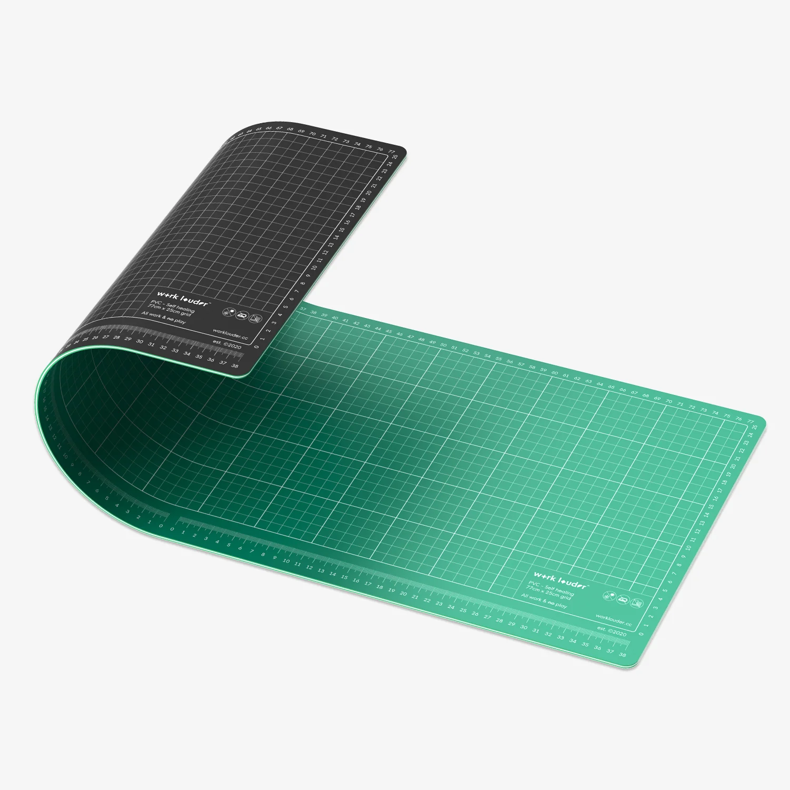

Hello world, because i wouldn't be a proper dev without including that somewhere in my first post.

I have wanted to rebuild my personal site for quite some time now. The old site was built when i was first getting into the software industry as a means to have a dedicated place to showcase my personal projects and help me land my first job. Though, i was lucky enough to acquire my first role in the industry before i could complete it and the site was abandoned and remained uncompleted for many years.

So, it's time for a change...

In a world of AI generated slop, i have found that there is nothing quite like authentic, human craftsmanship and unfortunately, that seems to be dwindling. I have been seriously inspired by makers like [matt3o](https://matt3o.com) to create this log and to share my work in a way that is both authentic and human and AI free. So i present to you:

## My Workbench

The design inspiration of this site comes from my own personal workbench which includes a [wrk. Mat](https://worklouder.cc/wrk-mat), a doubled sided, PVC cutting deskmat from *Work Louder* (no, i am not sponsored)

